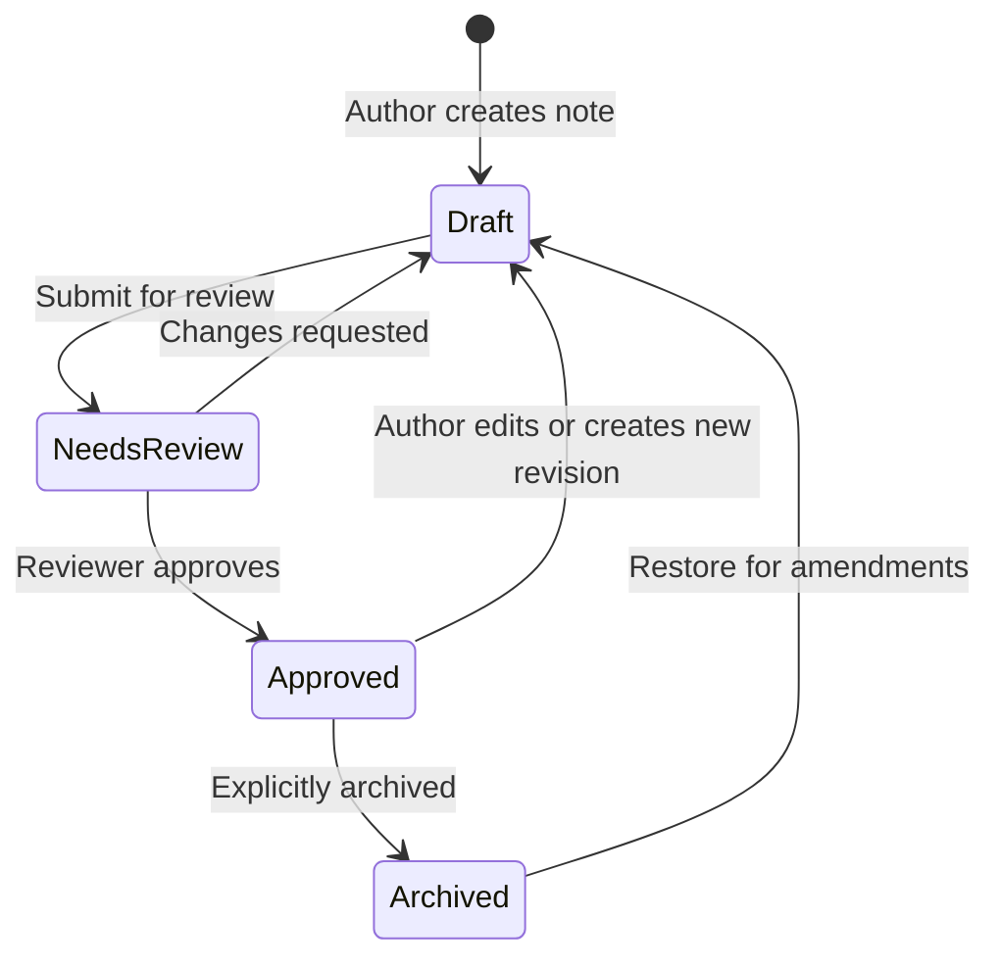

# Saraswati Knowledge Notes

Saraswati is a full-stack knowledge base tailor-made for human collaborators and AI agents that need conversational search, rich authoring, and reviewable note histories. Conceived and iterated by AI assistants like GitHub Copilot, it pairs a FastAPI backend with a Vite/React frontend, storing content and embeddings in Elasticsearch to unlock hybrid keyword + vector retrieval.

## Repo at a glance

```
backend/        FastAPI application, domain models, repositories, and services
frontend/       Vite + React UI built with Chakra UI components
config.yml      Shared configuration (Elasticsearch, auth, embedding provider)
```

Key capabilities:

- Markdown-first authoring with Mermaid diagram support and version diffing
- Native MCP (Model Context Protocol) endpoints so AI agents can browse, draft, and review notes programmatically
- Draft ➜ review ➜ publish workflow guarded by JWT-authenticated reviewers
- Hybrid search that blends BM25-style keyword scoring with embedding similarity
- Pluggable embedding provider (Ollama by default); Elasticsearch is the primary storage and retrieval engine

## Note lifecycle ♻️



- **Draft** – editable working copy owned by the author.
- **NeedsReview** – frozen snapshot awaiting reviewer feedback.
- **Approved** – published version discoverable by search and consumers.
- **Archived** – optional parking state for deprecated content; still versioned for posterity.

Backend services orchestrate state transitions; the frontend surfaces reviewer queues, diff views, and call-to-actions to keep content flowing.

## Quick start

### Backend (FastAPI)

```bash
cd backend
python3 -m venv .venv
source .venv/bin/activate
pip install -r requirements.txt
```

Configure connectivity in `../config.yml` (Elasticsearch URI, auth endpoints, embedding host). To point at an alternate config file, set `SARASWATI_CONFIG` to its path.

Run the API locally:

```bash
cd backend
.venv/bin/python -m uvicorn app.main:app --reload --port 8000
```

- REST routes live under `/knowledge/api/*`.
- When `frontend/dist` exists, the backend also serves the static bundle from `/knowledge`.

Execute backend tests:

```bash
cd backend
.venv/bin/python -m pytest
```

### Frontend (Vite + React + Chakra UI)

```bash
cd frontend
npm install
npm run dev
```

The dev server proxies API calls to `http://localhost:8000/knowledge/api`. Build for production with `npm run build`; artifacts land in `frontend/dist` and can be hosted by the backend or any static host.

### Optional: end-to-end smoke

With both servers running, visit `http://localhost:5173` for the authoring UI. Sign in using credentials recognized by your configured auth service and explore authoring, review, and history flows.

## Example `config.yml` (Elasticsearch)

Below is a minimal `config.yml` showing the Elasticsearch settings the backend expects. Adjust host/credentials to match your deployment. For production, prefer environment variables or a secrets store rather than committing credentials.

```yaml
# Minimal config.yml (Elasticsearch-backed)
elasticsearch:
	# Base URL for Elasticsearch (http or https)
	url: http://localhost:9200
	# A prefix used when creating indices (e.g. saraswati_notes_v1)
	index_prefix: saraswati
	# Optional basic auth; prefer to set these via environment variables in production
	username: elastic
	password: changeme
	# TLS options
	use_ssl: false
	verify_certs: true

auth:
	issuer: https://auth.example.com
	introspect_url: https://auth.example.com/introspect
		# Secret used to sign locally-issued JWTs when using elastic or decode validation modes
		jwt_secret: changeme
		jwt_algorithm: HS256

embeddings:
	provider: ollama
	host: http://localhost:11434

mcp:
	enabled: true
	host: http://localhost:9000
```

Notes:

- To avoid storing secrets in YAML, set `ELASTIC_URL`, `ELASTIC_USER`, and `ELASTIC_PASSWORD` in your environment and update the backend `config` loader to prefer env vars.
- `index_prefix` helps with multi-tenant or staged deployments (e.g., `sarasafti_prod_notes_v1`).

Optional: create a simple Elasticsearch index with a dense vector mapping (Elasticsearch 8+):

```bash
curl -X PUT "http://localhost:9200/saraswati_notes_v1" -H 'Content-Type: application/json' -d \
'{\
	"mappings": {\
		"properties": {\
			"title":     {"type":"text"},\
			"content":   {"type":"text"},\
			"embedding": {"type":"dense_vector","dims":1536}\
		}\
	}\
}'
```

Adjust `dims` to match the dimensionality returned by your embedding provider.

Note on auto-creation vs manual index creation
---------------------------------------------

Elasticsearch will happily auto-create an index when the application indexes the first document. That behavior is convenient for quick local testing. However, the README includes manual index creation commands because dynamic auto-mapping often produces suboptimal or incorrect mappings for production features (especially embeddings and aggregations):

- dense_vector fields must be present in the mapping up front (otherwise indexing embeddings can fail).
- fields used for aggregations or exact-match filters (for example `tags` or `created_by`) should be mapped as `keyword` to ensure aggregations work properly.
- you likely want control over analyzers, tokenization, shard/replica counts, and ILM policies.

Recommendation: allow auto-create for throwaway dev tests, but pre-create indices or use index templates for any real workload.

Users index and creating an initial user

When `auth.auth_system` is set to `elastic`, the backend expects a `users` index (name configurable via `elasticsearch.users_index`) with simple user documents. A minimal mapping might look like this:

```bash
curl -X PUT "http://localhost:9200/saraswati_users_v1" -H 'Content-Type: application/json' -d \
'{\
	"mappings": {\
		"properties": {\
			"username": {"type": "keyword"},\
			"name": {"type": "text"},\
			"roles": {"type": "keyword"},\
			"password_hash": {"type": "keyword"}\\
		}\
	}\
}'
```

Create a user by hashing the password with SHA256 and indexing the document. Example (Linux/macOS):

```bash
PASSWORD="s3cret"
HASH=$(echo -n "$PASSWORD" | sha256sum | awk '{print $1}')
curl -X POST "http://localhost:9200/saraswati_users_v1/_doc" -H 'Content-Type: application/json' -d \
'{"username": "alice", "name": "Alice Example", "roles": ["author","reviewer"], "password_hash": "'"$HASH"'"}'
```

The backend will verify the SHA256 hex digest on login and issue a locally-signed JWT using `auth.jwt_secret`.

## Architecture highlights

- **Repositories** (`backend/app/repositories`) abstract persistence so Elasticsearch or in-memory stores can be swapped per environment (Elasticsearch is the primary store).
- **Services** (`backend/app/services`) centralize business rules like embedding generation, note versioning, and search ranking.
- **Routes** (`backend/app/routes`) provide FastAPI endpoints with dependency-injected services and JWT guardrails.
- **Frontend** uses Chakra UI theming (`frontend/src/theme.ts`) and React Router (`frontend/src/router.tsx`) to organize pages such as Authoring, Review, History, and Search.

- **AI agent surfaces** – MCP-compliant handlers expose note metadata, drafts, reviews, and search utilities so Model Context Protocol clients can collaborate alongside human teammates.

## Search & embeddings

- Embeddings are requested from an Ollama host defined in `config.yml`.
- Vector data and markdown payloads are stored in Elasticsearch indices to enable hybrid BM25 + cosine retrieval.
- Elasticsearch is the primary store and search engine; see `backend/app/elasticsearch_client.py` for the client and index wiring used to power ranking and vector lookup.

## Authentication overview

Authentication
--------------

This project supports three authentication modes (selectable with `auth_system` in `backend/config.yml`):

- `introspect` — the backend delegates token validation to an external identity provider using a token introspection endpoint (RFC 7662). Use this for opaque tokens or when the provider is the authority on session state.
- `decode` — the backend locally validates JWTs (signature, exp, aud, iss). Use this when tokens are standard JWTs and you have the signing secret or the issuer's JWKS.
- `elastic` — the application manages users in Elasticsearch and issues locally-signed JWTs (native auth). This is useful when you want the app to control user accounts and token issuance.

How the backend uses these modes
- Login (`POST /knowledge/api/auth/login`):
	- `elastic` — handled by the native login implementation (`app.auth_native.login_native`): verifies password (SHA256 hex digest), then issues a local JWT signed with `auth_native.jwt_secret`.
	- `introspect` — the backend proxies credentials to the configured external login endpoint (`auth_external.login_path`) and returns the provider's access token and user info.
	- `decode` — server-side login isn't supported (the backend only decodes/validates tokens). For local accounts prefer `elastic`.

- Protected endpoints: the backend performs token validation according to the selected `auth_system` by calling `introspect_token()` (see `app.auth`).

Config keys (short reference)
- `auth_system`: one of `introspect`, `decode`, or `elastic`.
- `auth_external` (used for `introspect`):
	- `service`: base URL for provider (e.g. `https://auth.example.com`).
	- `login_path`: relative path for login proxy (e.g. `/api/auth/login`).
	- `introspect_path`: relative path for token introspection (e.g. `/introspect`).
	- `audience`, `issuer` (optional): used to validate tokens/introspection responses.
	- `cache_ttl_seconds`: TTL for cached introspection results (backend uses this value; see caching notes below).
- `auth_native` (used for `elastic` or `decode`):
	- `jwt_secret`: secret used to sign local JWTs (required for `elastic` and `decode` when using HMAC).
	- `jwt_algorithm`: e.g. `HS256`.
	- `audience`, `issuer`, `cache_ttl_seconds`.

What is sent to an introspection endpoint
- The backend posts JSON to `<service><introspect_path>` with the following body:

    ```json
    {
        "token": "<the raw bearer token string>",
        "audience": "<configured audience or null>"
    }
    ```

- Expected response: a JSON object with an `active` boolean (RFC 7662). For compatibility the backend also accepts a legacy `auth` boolean and maps it to `active`.

Caching introspection results (what changed)
- To avoid an external network round-trip for every protected request, the backend now implements a simple process-local in-memory TTL cache for successful introspection results.
	- Location: `backend/app/auth_external.py` (module-level cache).
	- Cache key: the token string.
	- TTL source: `auth_external.cache_ttl_seconds` from `backend/config.yml` (integer seconds).
	- Only caches responses where the provider returned an active/true result.
	- Process-local: if you run multiple worker processes each process has its own cache. For a shared cache use Redis (not currently included).

- Recommendation: use a conservative TTL (300 seconds / 5 minutes) for typical short-lived access tokens. Your `config.yml` may currently contain a longer value (e.g. `30000`), which increases the time required to notice a server-side revocation.

Login proxy / backend-issued tokens (when provider only implements `/api/auth/login`)
- If the external system only implements a login endpoint but does not provide an introspection endpoint or JWKS, you can let the backend proxy login and issue local tokens:
	- Configure `auth_system: elastic` and set `auth_native.jwt_secret`.
	- The backend will forward credentials to the external `/api/auth/login` (configured via `auth_external.service` + `login_path`). On success the backend can create or update a local user record in Elasticsearch and issue a local JWT.
	- This pattern centralizes token validation and enables immediate revocation via the application (because tokens are locally-issued).

Switching modes in `config.yml`
- `introspect` (external provider):

    ```yaml
    auth_system: introspect
    auth_external:
        service: https://auth.example.com
        login_path: /api/auth/login
        introspect_path: /oauth2/introspect
        audience: saraswati
        cache_ttl_seconds: 300
    ```

- `decode` (local JWT validation):

    ```yaml
    auth_system: decode
    auth_native:
        jwt_secret: your-shared-secret-or-empty-if-using-jwks
        jwt_algorithm: HS256
        audience: saraswati
    ```

- `elastic` (native / backend-issued tokens):

    ```yaml
    auth_system: elastic
    auth_native:
        jwt_secret: very-secret-value
        jwt_algorithm: HS256
        cache_ttl_seconds: 3600
    ```

How to test introspection locally
- If you have an external provider with an introspection endpoint, set `auth_external.service` and `auth_external.introspect_path` to point at it and restart the backend. Example introspection request (provider side):

    ```bash
    curl -X POST "https://auth.example.com/oauth2/introspect" \
        -H 'Content-Type: application/json' \
        -d '{"token":"<access-token>","audience":"saraswati"}'
    ```

- To test the backend flow against your provider:
	1. POST credentials to the backend login proxy (if using `introspect` the backend will proxy credentials to your provider):

    ```bash
    curl -X POST "http://localhost:8000/knowledge/api/auth/login" -H 'Content-Type: application/json' -d '{"username":"alice","password":"s3cret"}'
    ```

	2. Use the returned `access_token` for protected calls. The backend will introspect or decode the token depending on configuration.

	3. To validate caching behavior: call a protected endpoint twice and inspect provider logs — only the first call should trigger an introspection POST while subsequent requests within TTL will be served from the backend cache.

Security notes
- Always use HTTPS for provider endpoints and set an appropriate introspection TTL that balances performance and revocation requirements.
- When using `decode` with RS256, prefer validating against the provider's JWKS rather than shipping a shared secret.
- Keep `auth_native.jwt_secret` secret. Rotate keys periodically and plan for safe re-issuance of tokens.

Files of interest
- `backend/app/auth_external.py` — external provider login and introspection; now contains a module-level in-memory TTL cache used for introspection results.
- `backend/app/auth_native.py` — native login/register and local JWT issuance/validation.
- `backend/app/auth.py` — facade routing login/introspect/register calls to the appropriate implementation depending on `auth_system`.

If you want, I can:
- lower the default `auth_external.cache_ttl_seconds` in `config.yml` to `300` and add a comment explaining trade-offs,
- add a simple cache hit/miss logging endpoint to help debug introspection calls, or
- swap the in-memory cache for a Redis-backed cache (requires Redis and config). 

---

End of authentication docs.

